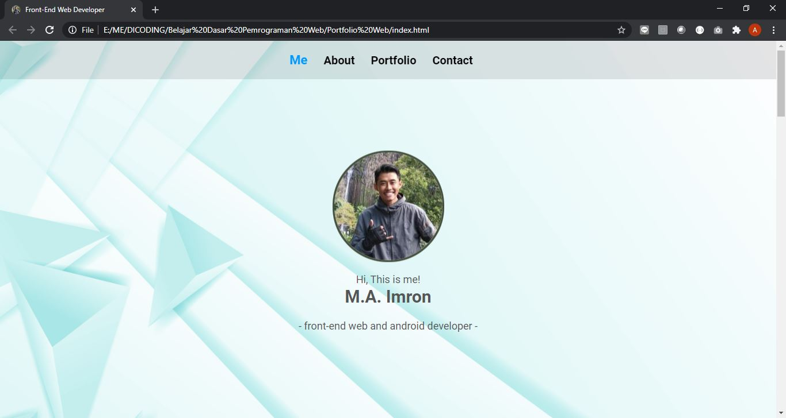
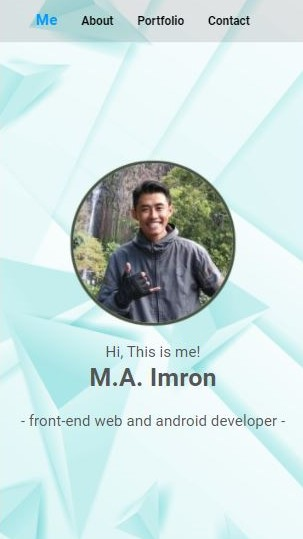
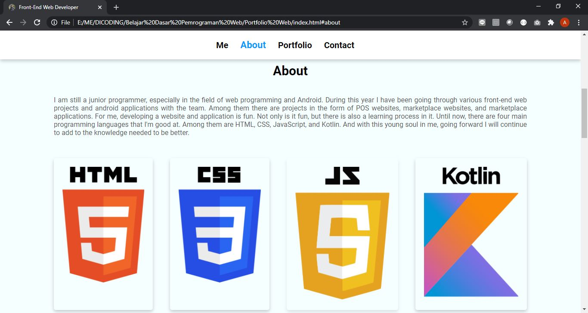
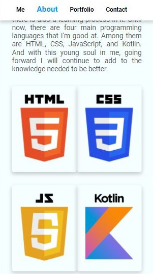
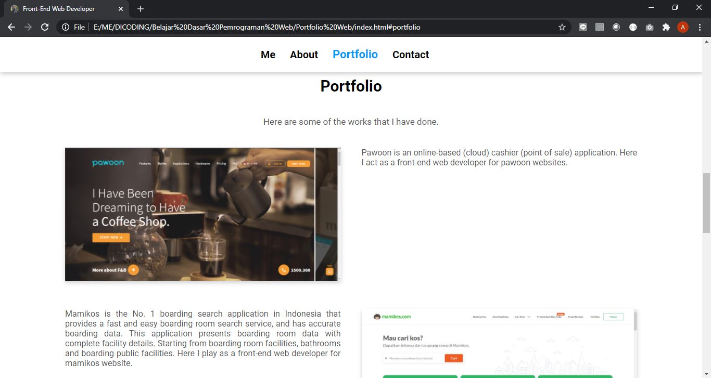
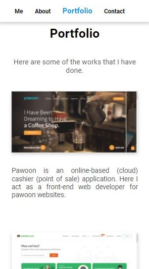
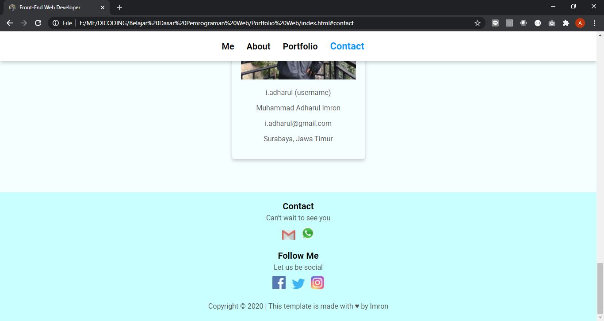
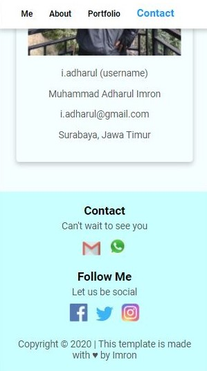

# One-Page-Portfolio-Website
## About This Website
This website was created when I took the Basic Web Programming course to implement HTML Semantic Elements, Media Query, Flexbox, and DOM manipulation.
To see a preview of this app, you can check the website [here](https://i-adharul.github.io/One-Page-Portfolio-Website/). Or you can watch the preview video [here](https://drive.google.com/file/d/1yRcNn4MYzcvCYQ8OIaaw1U3gPhQNeWcs/view?usp=sharing).

## Screenshots
### Me Element
 

### About Element
 

### Portfolio Element
 

### Contact Element
 
